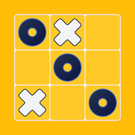

# Tic-Tac-Toe Game

A simple command-line implementation of the classic Tic-Tac-Toe game in Python.



## Features

- 🎮 Command-line based interface
- 🎲 Random first player selection
- 📋 Clear board position guide
- ⌨️ Simple cell number input system
- 🎯 Win detection for rows, columns, and diagonals
- 🤝 Tie game detection
- ❌ Input validation and error handling
- 🚪 Quit game option

## Installation

1. Clone this repository:
```bash
git clone https://github.com/yourusername/Tic-Tac-Toe.git
cd Tic-Tac-Toe
```

2. Make sure you have Python 3.x installed on your system.

## How to Play

1. Run the game:
```bash
python src/main.py
```

2. The game will display the cell positions numbered 1-9:
```
Cell positions:
 1 | 2 | 3 
-----------
 4 | 5 | 6 
-----------
 7 | 8 | 9 
```

3. Players take turns entering a number (1-9) to place their mark (X or O).
4. The game ends when either:
   - A player wins by getting three marks in a row (horizontal, vertical, or diagonal)
   - The board is filled (tie game)
   - A player quits (by entering 'q')

## Controls

- Enter numbers 1-9 to place your mark
- Enter 'q' to quit the game

## Author

Mohammadreza Naseri
## License

This project is licensed under the MIT License - see the [LICENSE](LICENSE) file for details.